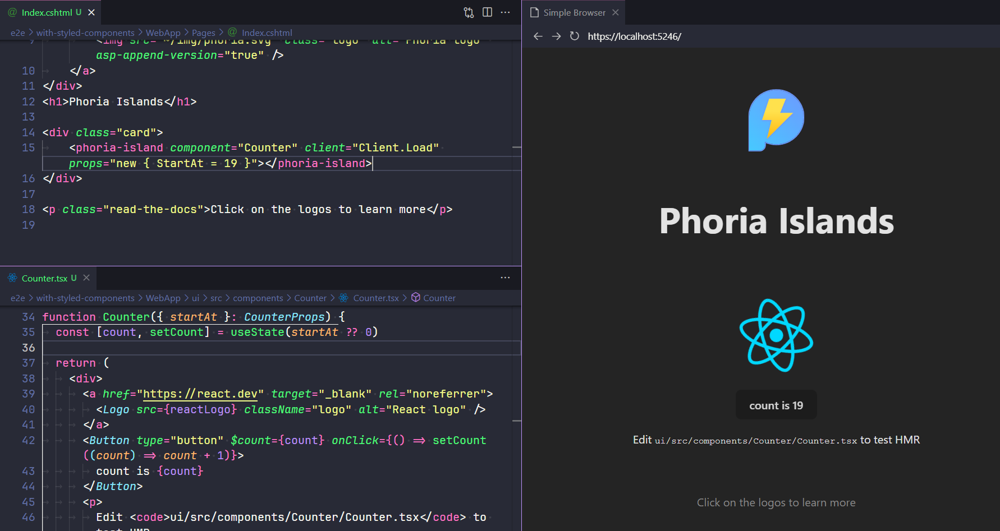

  

  <h1>phoria  </h1>
  
🏝️ <i>Islands architecture for dotnet powered by Vite</i> ⚡

  

Phoria allows you to easily and efficiently render [islands of interactivity](https://docs.astro.build/en/concepts/islands/) using [React](https://react.dev/), [Svelte](https://svelte.dev/) or [Vue](https://vuejs.org/) within your dotnet web app (Razor Pages or MVC) using both Client Side Rendering (CSR) and Server Side Rendering (SSR).

* ⚡ Built around [Vite](https://vite.dev/), which means you can enjoy a first class development experience, lightning fast HMR and access to its expansive plugin catalogue and ecosystem
* 🏝️ Easily and efficiently render islands using any supported UI framework (or frameworks)
* 🌊 Client Side Rendering and support for multiple client hydration strategies via client directives such as on load, on idle, on visible and on match media query
* 🔋 Server Side Rendering of Islands within your dotnet web app (Razor Pages or MVC) views
* 📦 Easily pass props from your dotnet web app to your Islands
* ⚙️ Shared configuration between dotnet and Vite using standard dotnet `appsettings.json` files and `dotnet dev-certs`

## Getting started

The quickest way to get started is to clone an example project using [giget](https://unjs.io/packages/giget):

* React: `npx giget@latest gh:cmeeg/phoria-examples/examples/framework-react my-project`
* Svelte: `npx giget@latest gh:cmeeg/phoria-examples/examples/framework-svelte my-project`
* Vue: `npx giget@latest gh:cmeeg/phoria-examples/examples/framework-vue my-project`

Or feel free to choose any one of the [other examples available](https://github.com/CMeeg/phoria-examples/tree/main/examples).

> [!IMPORTANT]
> Please see the [Getting started](./docs/guides/getting-started.md) guide for a complete guide to getting up and running with Phoria including how to [add Phoria to an existing dotnet project](./docs/guides/getting-started.md#manually-add-phoria-to-an-existing-dotnet-project).

## Usage

> [!NOTE]
> The Usage documentation is a work in progress. If there is something missing that needs clarification while it is being worked on, or if you have an idea or request for documentation not mentioned below, please raise an issue.

* Phoria Islands
  * Supported UI frameworks
  * Component register
* Phoria Server
  * Client Entry
  * Server Entry
* Phoria Web App
* Configuration
* [Building for production](./docs/guides/building-for-production.md)
* Deployment

## Acknowledgements

### Inspiration

The idea for this project came about after using [Astro](https://astro.build/) and thoroughly enjoying the whole experience with their implementation of the [Islands architecture](https://docs.astro.build/en/concepts/islands/). Astro was the catalyst and continues to inspire to this day.

The approach that the Remix team took to their [Vite plugin](https://remix.run/docs/en/main/guides/vite) and how they structure their applications is also a big inspiration.

This [presentation](https://www.youtube.com/watch?v=Ptqaqls2SYo) and [sample code](https://github.com/bholmesdev/vite-conf-islands-arch/blob/main/src/client.ts) by Ben Holmes (core maintainer of Astro) was the inspiration for using custom HTML elements in the implementation of Phoria Islands.

### Implementation

This project would have been significantly slower to get off the ground if it wasn't for the amazing work done by the maintainers of:

* [Vite.AspNetCore](https://github.com/Eptagone/Vite.AspNetCore); and
* [NodeReact.NET](https://github.com/DaniilSokolyuk/NodeReact.NET)

The initial idea was to just consume and use these libraries in Phoria, but the scope for Phoria quickly diverged and would have required submitting changes upstream that seemed at odds with the scope of these libraries.

Parts of their codebases are used in the dotnet Phoria library and helped form a basis from which to build out some of the features that Phoria provides.
