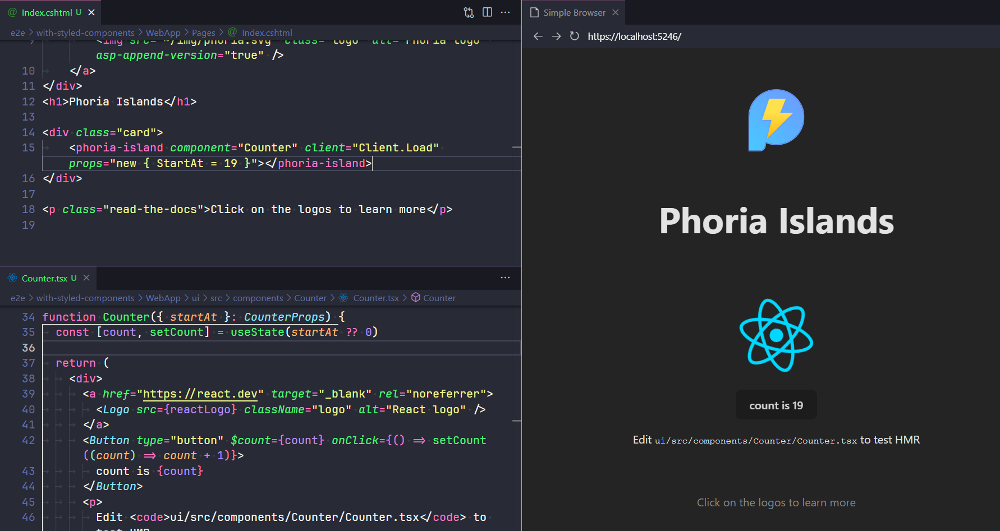

<div align="center">
  <p></p>
  <h1>Phoria<br><br></h1>
  <p>🏝️ <i>Islands architecture for .NET powered by Vite</i> ⚡</p>
  <p><hr></p>
</div>

Phoria renders [islands of interactivity](https://docs.astro.build/en/concepts/islands/) using [React](https://react.dev/), [Svelte](https://svelte.dev/) or [Vue](https://vuejs.org/) inside .NET Razor Pages or MVC applications with both Client Side Rendering (CSR) and Server Side Rendering (SSR).

* ⚡ Built around [Vite](https://vite.dev/) with HMR and access to its plugin ecosystem
* 🏝️ Use one or multiple supported UI frameworks in the same .NET application
* 🌊 Choose client-only rendering or hydration with `load`, `idle`, `visible` and media-query directives
* 🔋 Server-render islands from Razor Pages or MVC views
* 📦 Pass typed .NET data to islands as serialized props
* ⚙️ Share configuration between .NET and Vite through `appsettings.json`
* 🩺 Monitor the Phoria Server with health checks and choose graceful degradation or fail-fast behavior
* 📈 Add optional OpenTelemetry logging, tracing and metrics to the Node sidecar and example applications



## Getting started

The repository includes two standalone examples:

* [`examples/getting-started`](./examples/getting-started) demonstrates React.
* [`examples/framework-multiple`](./examples/framework-multiple) demonstrates React, Svelte and Vue together.

Examples are standalone workspaces. Run their commands from the example's `WebApp` directory:

```shell
cd examples/getting-started/WebApp
pnpm install
pnpm dev
```

See the [Getting started guide](./docs/guides/getting-started.md) to add Phoria to an existing .NET project.

## Usage

* [Getting started](./docs/guides/getting-started.md)
* [Creating Phoria Island components](./docs/guides/creating-phoria-island-components.md)
* [Phoria Island directives](./docs/guides/directives.md)
* [Building for production](./docs/guides/building-for-production.md)
* [Deployment](./docs/guides/deployment.md)

> [!NOTE]
> The guides cover the current setup and runtime model. If something is unclear or missing, please raise an issue.

## About Phoria

The idea for this project came about after using [Astro](https://astro.build/) and enjoying the whole experience with their implementation of [Islands architecture](https://docs.astro.build/en/concepts/islands/). I began to wonder what it would be like to have a similar experience in dotnet where the back-end is driven by dotnet Razor Pages or MVC, but you could easily add islands of interactivity using modern UI framework components.

Looking at the existing dotnet ecosystem:

* Blazor allows for a component-driven UI architecture, but it requires buying into a completely different and much less mature ecosystem than those offered, and already embraced by, the wider UI development community
* Microsoft seem to have settled on recommending a BFF (Backend For Frontend) pattern for integrating dotnet with UI frameworks such as React, Vue etc - this is certainly a valid approach, but isn't always a good fit if you would prefer or have to use dotnet at the application layer instead of "just" to deliver APIs

Phoria's aim is to allow you to build a dotnet web application using the tools and libraries you are already familiar with on the back-end, but with the added benefit of being able to easily and efficiently render islands of interactivity using the UI frameworks and libraries you are familiar with on the front-end.

## Acknowledgements

### Inspiration

[Astro](https://astro.build/) is the primary inspiration for this project in both its conception and implementation.

The approach that the Remix team took to their [Vite plugin](https://remix.run/docs/en/main/guides/vite) and how they structure their applications is also a big inspiration.

This [presentation](https://www.youtube.com/watch?v=Ptqaqls2SYo) and [sample code](https://github.com/bholmesdev/vite-conf-islands-arch/blob/main/src/client.ts) by Ben Holmes (core maintainer of Astro) was the inspiration for using custom HTML elements in the implementation of Phoria Islands.

### Implementation

This project would have been significantly slower to get off the ground if it wasn't for the amazing work done by the maintainers of:

* [Vite.AspNetCore](https://github.com/Eptagone/Vite.AspNetCore); and
* [NodeReact.NET](https://github.com/DaniilSokolyuk/NodeReact.NET)

The initial idea was to just consume and use these libraries in Phoria, but the scope for Phoria quickly diverged and would have required submitting changes upstream that seemed at odds with the scope of these libraries. For example, `Vite.AspNetCore` is focused on client-side rendering and `NodeReact.NET` is focused (unsurprisingly) on React and uses Webpack.

Parts of their codebases are used in the dotnet Phoria library (with license attribution) and helped form a basis from which to build out some of the features that Phoria provides. So a massive thank you to the maintainers of these libraries!

Phoria also wouldn't be possible without:

* [Vite](https://vite.dev/) and its amazing ecosystem of plugins and tools
* [h3](https://h3.unjs.io/) and the [unjs](https://unjs.io/) ecosystem
* The [Tinylibs](https://tinylibs.github.io/) libraries
