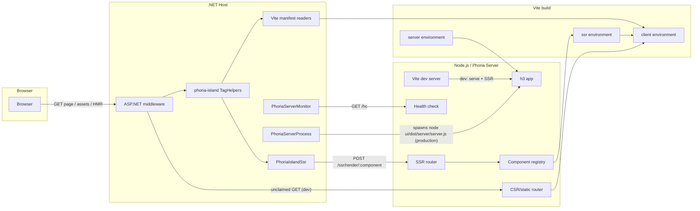
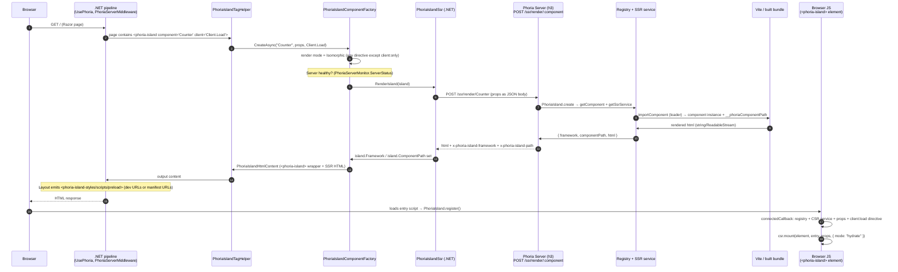

# Architecture

Phoria is an Islands architecture framework for .NET web applications, powered by Vite. A .NET Razor Pages or MVC application renders the host page, while Vite produces the client and server bundles used to render islands of interactivity (React, Svelte, Vue) via both Client Side Rendering (CSR) and Server Side Rendering (SSR).

At a high level, Phoria is three runtimes that cooperate over HTTP:

- **The .NET host** (`Phoria` NuGet package) — renders the host page, exposes the `<phoria-island>` TagHelper and entry/preload TagHelpers, calls the Phoria Server for island SSR, reads the Vite manifests, and optionally owns the Phoria Server process.
- **The Phoria Server** (Node.js/h3 sidecar built from the app's `src/server.ts` via the `server` Vite environment) — renders islands to markup over HTTP, serves the built client assets, and exposes a health check for the .NET host to poll.
- **Vite** — builds the client, SSR, and Phoria Server bundles using the [Environment API](https://vite.dev/guide/api-environment), and in development serves the client and SSR environments directly through the Phoria Server.

The supported UI integrations (React, Svelte, Vue) are thin adapters (`@phoria/phoria-react`, `@phoria/phoria-svelte`, `@phoria/phoria-vue`) that plug into the core `@phoria/phoria` runtime. A companion Vite plugin (`@phoria/vite-plugin-dotnet-dev-certs`) wires the .NET development certificate into the Node side for local HTTPS.



The production build emits three bundles in dependency order (client → SSR → Phoria Server). The client build produces the `manifest.json` consumed by the .NET entry TagHelpers and the `ssr-manifest.json` consumed by the .NET preload TagHelper; the SSR build does not read either manifest.

The Phoria Server is a Node process that must run alongside the .NET web app host; Phoria itself does not mandate how it is started. A developer can run it manually in a local environment, an orchestrator such as Aspire can manage it (the recommended approach for local development), or the web app can spawn and supervise it itself by configuring `Phoria:Server:Process` (the approach used in Production). See [Running the Phoria Server](#running-the-phoria-server).

This document is a deep dive intended to make the runtime model precise enough to implement features and investigate bugs without re-deriving the design. Detailed configuration and usage live in [`docs/guides/`](guides/), and milestone scope is tracked in [`PROJECT.md`](PROJECT.md).

---

## Runtime components

### The .NET host (`packages/Phoria/`)

The NuGet package targets `net8.0;net10.0` (`Phoria.csproj`), references the `Microsoft.AspNetCore.App` framework, and depends only on `CliWrap` (process management) and `Microsoft.IO.RecyclableMemoryStream` (pooled SSR buffers).

#### Configuration

All options live in `PhoriaOptions` (`PhoriaOptions.cs`), bound from the `"phoria"` appsettings section (`AddPhoria` calls `BindConfiguration("Phoria")`):

| Option | Default | Notes |
|---|---|---|
| `Root` | `"ui"` | Vite project root relative to the .NET content root |
| `Base` | `"/ui"` | Public base path; mirrors Vite's `base` |
| `Entry` | `""` | Client entry (e.g. `src/entry-client.ts`) |
| `SsrBase` | `"/ssr"` | Base path of the SSR endpoint on the Phoria Server |
| `SsrEntry` | `""` | SSR entry (e.g. `src/entry-server.ts`) |
| `Server.Host` / `Server.Port` | `"localhost"` / `5173` | Where the Phoria Server listens |
| `Server.Https` | `false` | Scheme the .NET side uses to reach the Phoria Server |
| `Server.HealthCheckInterval` | `5` | Seconds between health polls |
| `Server.HealthCheckTimeout` | `5` | Per-request health-check timeout |
| `Server.StartupTimeout` | `0` | Seconds to wait for the first healthy check before failing startup; `0` waits indefinitely |
| `Server.UnavailableBehavior` | `Degrade` | `Degrade` or `Fail` — behavior when the Phoria Server is unavailable |
| `Server.Process` | `null` | `{ Command, Arguments }` — spawns Node (production); `null` in dev |
| `Server.Process.HealthCheckInterval` | `10` | Process-supervision loop interval |
| `Server.Process.MaxRestartAttempts` | `0` | Max process restarts while unhealthy; `0` restarts indefinitely |
| `Build.OutDir` | `"dist"` | Vite build output dir relative to the Vite root |
| `Islands.PropsSerializer` | camelCase, nulls omitted | See [Props serialization](#props-serialization) |

> The defaults **must stay in sync** with the JS-side defaults in `packages/phoria-islands/src/server/appsettings.ts` — both sides default `root: "ui"`, `base: "/ui"`, `ssrBase: "/ssr"`, `server.host: "localhost"`, `server.port: 5173`, `server.https: false`, `build.outDir: "dist"`. The JS side additionally *requires* `entry` and `ssrEntry` (it throws when they are missing).

`PhoriaOptionsExtensions.cs` derives the server URLs used across the package: `GetServerUrl()` → `http://localhost:5173` (or `https://`), `GetServerUrlWithBasePath()` → `http://localhost:5173/ui`, and `GetBasePath()` → a normalized `/ui`.

#### Service registration (`ServiceCollectionExtensions.cs`)

`AddPhoria` registers the named `PhoriaServerHttpClient` (used for all .NET → Phoria Server calls). In **Development** it accepts any server certificate (`DangerousAcceptAnyServerCertificateValidator`) so the .NET side can talk HTTPS to the Node sidecar using the ASP.NET dev certificate; outside Development it uses default validation. The rest of the graph:

| Service | Lifetime | Purpose |
|---|---|---|
| `IPhoriaServerMonitor` → `PhoriaServerMonitor` | Singleton | Health state shared app-wide |
| `IPhoriaServerProcess` → `PhoriaServerProcess` | Singleton | Spawns/supervises Node |
| `PhoriaServerProcessService` | Hosted service | Runs the process supervisor |
| `PhoriaServerMonitorService` | Hosted service | Runs the health monitor |
| `IPhoriaServerHttpClientFactory` | Singleton | Creates the named client with base URL |
| `IViteManifestReader` / `IViteSsrManifestReader` | Singleton | Manifest parsing + file watching |
| `IPhoriaIslandSsr` → `PhoriaIslandSsr` | Singleton | SSR HTTP client |
| `IPhoriaIslandComponentFactory` | Scoped | Per-request island creation |
| `IPhoriaIslandScopedContext` | Scoped | Islands collected on a page |
| `PhoriaIslandEntryTagHelperMonitor` | Scoped | Guards dev Vite-client injection |
| `IViteDevServerHmrProxy` → `ViteDevServerHmrProxy` | Scoped | Dev HMR WebSocket proxy |

#### Middleware (`ApplicationBuilderExtensions.cs`, `Server/PhoriaServerMiddleware.cs`)

`UsePhoria` adds exactly one middleware, `PhoriaServerMiddleware`, which the examples place **last** in the pipeline. On a request it proxies only when: no endpoint matched (the request fell through routing, static files, and Razor Pages), the path is non-empty, it's a GET, and the server is healthy. Under `Fail`, unclaimed GETs return 503 when the server is unavailable, and a proxy failure mid-request also returns 503; under `Degrade`, requests fall through to normal 404 handling.

- Ordinary unclaimed GETs are forwarded to the Phoria Server (`GET {serverUrl}{path}`). Successful upstream responses copy the response body and media type; non-success responses fall through to the next .NET middleware. This is how the browser fetches client assets and `/@vite/client` in development.
- WebSocket requests with the `vite-hmr` subprotocol (`ViteDevServerHmrProxy.IsHmrRequest`) are forwarded to the Vite dev server via a two-way socket pump, which is what makes HMR work through the .NET app in dev (requires `app.UseWebSockets()` before `UsePhoria()`).

#### Server process & monitor (`Server/`)

- **`PhoriaServerMonitor`** polls `GET /hc` (`HealthCheckUrl = "/hc"`) against the Phoria Server URL every `HealthCheckInterval` seconds with a `HealthCheckTimeout` per request. The response JSON — `{ mode, frameworks }`, where `mode` is `NODE_ENV` and `frameworks` is the list of registered framework names — is deserialized into a `PhoriaHealthCheckResult` and exposed on the shared `PhoriaServerStatus` record (`PhoriaServerStatus.cs`), which also carries `Health` (`Unknown`/`Healthy`/`Unhealthy`) and `Mode` (`Unknown`/`Development`/`Production`). `StartMonitoring` **blocks until the first healthy check**, or fails after `Server.StartupTimeout` seconds when set (a `firstHealthy` `TaskCompletionSource`), so the .NET app won't serve SSR-enabled islands before the sidecar is up; `MonitorAsync` then refreshes health on a timer while preserving the last-known healthy `Mode`/`Frameworks` through downtime. The `PhoriaServerMonitorService` hosted service drives this lifecycle.
- **`PhoriaServerProcess`** starts the Node sidecar only when `Phoria:Server:Process` is configured (production). It uses `CliWrap` to run `{Command} {Arguments}` (e.g. `node ui/dist/server/server.js`) from the .NET content root, and a periodic supervision loop (`Process.HealthCheckInterval`, default 10 s) restarts the process if it exits while the monitor reports unhealthy. A positive `Process.MaxRestartAttempts` bounds the restart counter; `0` restarts indefinitely. Shutdown is graceful: SIGTERM (SIGKILL on Windows), a 6-second grace period, then a force-kill of the process tree (`StopGracePeriod`). `PhoriaServerProcessService` is the hosted service that runs `StartServer` and ensures `StopServer` runs on host shutdown.

#### The islands layer (`Islands/`)

- **`PhoriaIsland`** (`PhoriaIsland.cs`) is the runtime model: `ComponentName`, `Props`, `RenderMode` (`ServerOnly`/`ClientOnly`/`Isomorphic`), `Client` (the hydration directive), and `Framework`/`ComponentPath` — the latter two are **filled in from the SSR response headers**, not set by the developer. The static `Client` class is the Razor-facing factory for directives: `Client.Only`, `Client.Load`, `Client.Idle(timeout?)`, `Client.Visible(rootMargin?)`, `Client.Media(query)`.
- **`PhoriaIslandTagHelper`** is the core `<phoria-island component props client>` tag. It delegates to `PhoriaIslandComponentFactory.CreateAsync` and replaces itself with a `PhoriaIslandHtmlContent`.
- **`PhoriaIslandComponentFactory`** (scoped) derives the render mode from the directive: no `client` attribute → `ServerOnly`; `client:only` → `ClientOnly`; any other directive → `Isomorphic`. It consults the monitor and:
  - `Isomorphic` + unhealthy server → **degrades to `ClientOnly`** (renders the web component with no SSR markup) and logs a warning;
  - `ServerOnly` + unhealthy server → **throws `PhoriaIslandComponentException`** (logged, then suppressed by the tag helper);
  - `ClientOnly` is unaffected.
  It adds every island to the scoped context (so `<phoria-island-preload>` can see every island on the page). For non-`ClientOnly` modes it calls `PhoriaIslandSsr.RenderIsland` and wraps the result in `PhoriaIslandHtmlContent`.
- **`PhoriaIslandSsr`** is the SSR HTTP client. It serializes `island.Props` (via `Islands.PropsSerializer`) to a pooled stream and `POST`s it as JSON to `{SsrBase}/render/{ComponentName}` on the Phoria Server URL. The response body (the rendered HTML) is pooled, and the `x-phoria-island-framework` / `x-phoria-island-path` response headers are copied into `island.Framework` / `island.ComponentPath`. The SSR call is a plain server-to-server POST — cookies, headers, and auth from the original browser request are **not** forwarded; props are the only request input, HTML plus the two headers the only output.
- **`PhoriaIslandHtmlContent`** writes the emitted markup. For `ServerOnly` islands it writes only the SSR HTML. Otherwise it writes the `<phoria-island>` custom element wrapper:

  ```html
  <phoria-island component="Counter" client:load props="{&quot;startAt&quot;:5}" framework="react">[SSR HTML]</phoria-island>
  ```

  The `props` attribute prefers the echoed serialized props from the SSR request; the `client` directive becomes a bare attribute (`client:load`) or a valued one (`client:idle="200"`). The streamed SSR HTML is written out via `TextWriterBufferWriter` (`IO/TextWriterBufferWriter.cs`), and the underlying `RecyclableMemoryStream`s are returned to the pool (`IO/StreamPool.cs`) as soon as the tag is written.
- **`PhoriaIslandPropsSerializer`** — `SystemTextJsonPropsSerializer` uses camelCase naming, omits nulls, reads case-insensitively, and uses `JavaScriptEncoder.UnsafeRelaxedJsonEscaping` (props end up inside an HTML attribute, so HTML-entity escaping is deliberately disabled).

#### Entry & preload tags (`PhoriaIslandEntryTagHelper.cs`)

Three layout tags drive asset loading, and all resolve the same way through the base `PhoriaIslandEntryTagHelper`:

- `<phoria-island-styles />` → `<link rel="stylesheet">` for the client entry.
- `<phoria-island-scripts />` → `<script type="module">` for the client entry.
- `<phoria-island-preload />` → modulepreload/stylesheet links for every island's component modules (production only).

The base helper handles `phoria-src`/`phoria-href` on `script`/`link` elements:

- **Development** (`ServerStatus.Mode == Development`): script/link values point directly at the Vite dev server (`{serverUrl}/{value}`). It injects the `@vite/client` script once per request (tracked by the scoped `PhoriaIslandEntryTagHelperMonitor`), prepending the React Fast Refresh preamble when the health-check frameworks include `"react"` — because .NET serves the HTML, Vite's own `transformIndexHtml` preamble never runs. `<link>` tags pointing at script-like files are suppressed.
- **Production**: values are resolved against the Vite `manifest.json` to their hashed content URLs (`PhoriaIslandUrlHelper.GetContentUrl`). For a script entry, the recursive CSS files (`ViteManifestExtensions.GetRecursiveCssFiles`) are emitted; additional stylesheets clone the `<link>` into `PreElement`.
- **Preload** (`PhoriaIslandPreloadTagHelper.cs`): reads the `ssr-manifest.json`, and for each island's `ComponentPath` emits `<link rel="modulepreload">`/`<link rel="stylesheet">`/image/font preloads (`PhoriaIslandPreloadHtmlContent`) for the module and its dependency files. This is the chain that ties a rendered island to its preloaded chunks.

#### Vite manifest handling (`Vite/`)

- `ViteManifestReader` parses `.vite/manifest.json` at `<contentRoot>/<root>/<outDir>/phoria/client/.vite/manifest.json`, caches it, and watches the file for changes (dev returns an empty manifest with a one-time warning).
- `ViteSsrManifestReader` does the same for `ssr-manifest.json` in the same directory.
- `ViteChunk` models a single manifest entry (`File`, `Src`, `IsEntry`, `Imports`, `Css`, `Assets`, `DynamicImports`, `IsDynamicEntry`); the entry's *name* is the manifest dictionary key.

---

### The core JS runtime (`packages/phoria-islands/`, published as `@phoria/phoria`)

The package exposes four entry points (`package.json` `exports`):

| Entry | Source | What it provides |
|---|---|---|
| `.` | `src/main.ts` | Registration API and shared types |
| `./client` | `src/client/main.ts` | The `<phoria-island>` custom element, directives, CSR service contract |
| `./server` | `src/server/main.ts` | h3 request-handler factories, appsettings, `PhoriaIsland` (server), SSR service contract |
| `./vite` | `src/vite/plugin.ts` | The `phoria()` Vite plugin |

`@phoria/phoria` is externalized from the `ssr` and `server` build environments, so those bundles load it via Node's ESM loader rather than bundling it.

#### Component registration (`src/register.ts`, `src/phoria-island.ts`)

Registration happens at **module scope** through four module-level registries: `frameworkRegistry`, `ssrServiceRegistry`, `csrServiceRegistry`, and `componentRegistry`. All names are lowercased, so lookups are case-insensitive.

The public API is:

- `registerFramework` / `getFramework` / `getFrameworks` — framework names (e.g. `"react"`); `getFrameworks()` feeds the health-check payload.
- `registerSsrService` / `getSsrService` — the server-side renderer for a framework; registering a service also registers its framework.
- `registerCsrService` / `getCsrService` — the client-side mounter for a framework.
- `registerComponent(name, { loader, framework })` / `registerComponents(record)` / `getComponent(name)` — component entries keyed by lowercased name. Registering a component for an unregistered framework throws.

A component entry's `loader` is either:

- a **default-export loader**: `() => import("./Counter.vue")` (the module's `default` export is the component), or
- a **module/component pair**: `{ module: () => import("./Counter/Counter.tsx"), component: (m) => m.Counter }`.

`importComponent` resolves an entry to a live `PhoriaIslandComponent` (`{ component, componentName, framework, componentPath }`). The framework must be registered before its components — in practice the framework package's server/client entry (which calls `registerSsrService`/`registerCsrService`) is imported before the app's `register.ts` in `entry-server.ts`/`entry-client.ts`.

#### The `__phoriaComponentPath` mechanism

The **framework** Vite plugins inject a literal export into each component module at build/dev time (via a `transform` hook using `MagicString`):

```ts
export const __phoriaComponentPath = "/src/components/Counter/Counter.tsx";
```

`importComponent` picks this off the loaded module namespace and attaches it to the `PhoriaIslandComponent.componentPath`. The framework SSR service bubbles it into its render result, the SSR router emits it as the `x-phoria-island-path` response header, and the .NET side stores it as `island.ComponentPath` — where `PhoriaIslandPreloadTagHelper` uses it to look up the island's modules in the `ssr-manifest.json`. This is the seam that ties a server-rendered island to its preloaded client chunks.

#### Client runtime (`src/client/`)

- **`PhoriaIsland`** (`src/client/phoria-island.ts`) is the `<phoria-island>` custom element. `connectedCallback` reads the `component` attribute, resolves the entry and CSR service from the registries, `JSON.parse`s the `props` attribute (absent → `null`), then:
  1. if `client:only` is present, mounts with `{ mode: "render" }` (full CSR, no hydration) — this has the highest priority;
  2. otherwise it finds the first hydration directive attribute present and runs the directive with `{ mode: "hydrate" }`;
  3. if none, it throws (`No known client directive was found.`).
  Errors are caught and `console.error`-ed (non-fatal). `PhoriaIsland.register()` defines the custom element when `customElements` exists.
- **Directives** (`src/client/directives.ts`) — `client:load` (mount immediately), `client:idle` (`requestIdleCallback` with an optional numeric timeout), `client:visible` (`IntersectionObserver` with an optional `rootMargin`), `client:media` (a required media query, mounts on match/change). They map 1:1 to the .NET `Client` directive factories.
- **CSR service contract** (`src/client/csr.ts`): `PhoriaIslandComponentCsrService.mount(island, component, props, options)` with `csrMountMode = { render, hydrate }`.

#### Server runtime (`src/server/`)

The Phoria Server is user code — the app's `src/server.ts` is built by the `server` Vite environment and composes the exported request-handler factories into an h3 app. The factories provided by `@phoria/phoria/server` (`src/server/routing.ts`):

- **`createPhoriaSsrRouter(loadServerEntry, base, logger)`** defines two routes:
  - `GET /hc` — loads and validates the SSR entry, returns `{ mode: NODE_ENV, frameworks: getFrameworks() }`. This is the health check the .NET monitor polls.
  - `POST /render/:component` mounted at `{ssrBase}` — resolves the component via `PhoriaIsland.create({ params, readProps })`, calls the user's `serverEntry.renderPhoriaIsland(island)`, sets the `x-phoria-island-framework` (always) and `x-phoria-island-path` (when the component exposed `__phoriaComponentPath`) headers, and returns `result.html` — a string or a `ReadableStream`. Errors become h3 500s with a logged cause.
- **`createPhoriaSsrRequestHandler`** (production) — dynamically `import()`s the built SSR entry at `<root>/<outDir>/phoria/ssr/<basename of ssrEntry>.js` (via `pathToFileURL` for Windows ESM safety) per request.
- **`createPhoriaDevSsrRequestHandler`** (development) — loads the SSR entry through the Vite dev server's runnable SSR environment (`runnableEnvironment.runner.import(appsettings.ssrEntry)`), so SSR uses Vite's transform pipeline and HMR.
- **`createPhoriaCsrRequestHandler`** (production) — serves the built client assets from `<root>/<outDir>/phoria/client/*` at `{base}` (default `/ui`) using h3's `serveStatic` with MIME types.
- **`createPhoriaDevCsrRequestHandler`** (development) — wraps `viteDevServer.middlewares`, so Vite serves client assets and HMR directly.

The SSR request is intentionally decoupled from h3: `PhoriaIslandRequest` (`{ params, readProps }`) and the opaque `PhoriaRequestHandler` type are the seams that make `PhoriaIsland.create` unit-testable and allow a future h3 major swap. `PhoriaIsland.create` (`src/server/phoria-island.ts`) looks up the component by name, resolves its SSR service, and validates that request-body props form a JSON object (an array or scalar body is rejected).

`src/server/vite.ts` — `createPhoriaViteDevServer` boots a middleware-mode Vite server (`appType: "custom"`) and attaches the raw `vite` module as `_vite`, so the dev SSR handler can run the environment without the app depending on `vite` directly.

#### Appsettings (`src/server/appsettings.ts`)

`parsePhoriaAppSettings` reads the `phoria` section from `appsettings.json` / `appsettings.{environment}.json` (walking up from `cwd` with `empathic`), where the environment name comes from `DOTNET_ENVIRONMENT` / `ASPNETCORE_ENVIRONMENT` (default `"Development"`). Inline settings passed to the plugin override, then base appsettings, then environment-specific appsettings. The same physical file is read by both the .NET side (via config binding) and the Node side — one source of truth.

#### The Vite plugin (`src/vite/plugin.ts`)

The `phoria()` plugin is deliberately small — it has only three hooks, no virtual modules:

- **`config`** — parses appsettings, registers the `client`, `ssr`, and (unless `serverEntry: false`) `server` environments, and sets `root`, `base`, and `server.host/port` from appsettings when the user hasn't set them. When it supplies the port it sets `strictPort: true`.
- **`configEnvironment`** — configures each environment:

  | Environment | Key settings | Output |
  |---|---|---|
  | `client` | `build.manifest`, `build.ssrManifest`, entry = `appsettings.entry` | `<outDir>/phoria/client` — emits `.vite/manifest.json` + `ssr-manifest.json` |
  | `ssr` | `build.ssr`, external `@phoria/phoria`, entry = `appsettings.ssrEntry` | `<outDir>/phoria/ssr` |
  | `server` | `build.ssr`, `target: "es2022"`, external `@phoria/phoria`, entry = plugin `serverEntry` | `<outDir>/server` (note: no `phoria/` prefix) |

- **`buildApp`** (`order: "pre"`) — builds the environments **sequentially in dependency order**: `client` → `ssr` → `server`. The client environment must finish first because the `ssr-manifest.json` it emits is consumed downstream.

---

### Framework adapters

Each framework package (`@phoria/phoria-react`, `@phoria/phoria-svelte`, `@phoria/phoria-vue`) follows the same four-entry pattern and plugs into the core runtime. Each exposes:

- **`.` (main)** — `const framework = { name: "react" } as const` (or `svelte`/`vue`).
- **`./client`** — a side-effect import that calls `registerCsrService(framework.name, service)`.
- **`./server`** — a side-effect import that calls `registerSsrService(framework.name, service)`, plus re-exports of its render helpers and an island type guard (`isReactIsland`, etc.).
- **`./vite`** — the framework Vite plugin.

The framework Vite plugins all do the same three things:

1. **Wrap the framework's own Vite plugin** — `react()` from `@vitejs/plugin-react`, `svelte()` from `@sveltejs/vite-plugin-svelte`, `vue()` from `@vitejs/plugin-vue` (passing `react: false` / `svelte: false` / `vue: false` opts out).
2. **Inject `__phoriaComponentPath`** — a `transform` hook matches component source files (`**/*.jsx`/`**/*.tsx`, `**/*.svelte`, `**/*.vue`, excluding `node_modules/**`), strips the `cwd` prefix from the module id, and appends `export const __phoriaComponentPath = "…";` via `MagicString`.
3. **Apply only to the right environments** — `applyToEnvironment` returns `environment.name === "client" || environment.name === "ssr"`. This guard is mandatory: the `server` environment's bundle must **not** be transformed with `__phoriaComponentPath` or the framework's JSX/Svelte/Vue processing.

Their `config` hooks register the `ssr` environment and pre-bundle runtimes via `optimizeDeps.include` (`["react", "react-dom/client"]`, `["svelte"]`, `["vue"]`); their `configEnvironment` hooks externalize `@phoria/phoria-<framework>/server` from the `ssr` environment. **Svelte additionally externalizes `svelte` itself** so that the Vite-transformed component and the renderer share a single `svelte/internal/server` instance (a duplicated module-level `ssr_context` would crash `push_element` reading `null`).

Server-side rendering and client-side mounting per framework:

| | SSR | CSR |
|---|---|---|
| **React** | `renderComponentToStream` (default, via `renderToReadableStream` from `react-dom/server.edge`) or `renderComponentToString`, both wrapping in `<StrictMode>` | `hydrateRoot` / `createRoot`, both in `<React.StrictMode>`; React and react-dom are dynamically imported; in dev a shim defines `window.$RefreshReg$`/`$RefreshSig$` because the Vite react-refresh preamble never runs |
| **Svelte** | `renderComponentToString` only — `render()` from `svelte/server`, returns `html.body` | `Svelte.hydrate` / `Svelte.mount` (Svelte 5); props passed only when non-null |
| **Vue** | `renderComponentToStream` (default, `renderToWebStream`) or `renderComponentToString`, via `createSSRApp` | `createApp().mount` — Vue has no explicit hydrate/render distinction |

All SSR services follow the same shape: verify the component belongs to this framework, `importComponent` the entry, call the chosen render helper with the props spread onto the component, and return `{ framework, componentPath, html }` (string or `ReadableStream`).

---

### The dev-certs plugin (`packages/vite-plugin-dotnet-dev-certs/`)

`@phoria/vite-plugin-dotnet-dev-certs` makes the Phoria Server (and Vite) use the ASP.NET development certificate for local HTTPS. In its `config` hook — **dev mode only** — it:

1. Locates the dev-cert base path (Windows: `%APPDATA%/ASP.NET/https`; Linux: `~/.aspnet/dev-certs/trust`; macOS: `~/.aspnet/dev-certs/https`).
2. Derives a certificate name from the nearest `package.json` name (sanitized).
3. Ensures `<name>.pem` / `<name>.key` exist, running `dotnet dev-certs https --export-path <path>.pem --format Pem --no-password` if not.
4. Sets `server.https = { cert, key }` on the Vite config (as file paths, only if the user hasn't set it).

The app's `src/server.ts` reads those paths from the Vite dev server config to build its own `listhen` HTTPS listener, so .NET, Vite, and the Phoria Server all share the same certificate in development. In Development the .NET side reciprocally accepts any server certificate (`DangerousAcceptAnyServerCertificateValidator`).

---

### Examples (`examples/`)

`getting-started` (React only) and `framework-multiple` (React + Svelte + Vue) share the same skeleton: an Aspire **AppHost**, a **WebApp** (.NET), and a **`ui/`** directory (the Vite root). They differ only in ports (getting-started: web app `5373`, Phoria Server `5273`; framework-multiple: `5573`/ `5473`).

The **AppHost** (`AppHost/Program.cs`) owns both processes:

- `builder.AddProject<Projects.WebApp>(...)` with `DOTNET_ENVIRONMENT`/ `ASPNETCORE_ENVIRONMENT` set from the launch profile.
- `builder.AddJavaScriptApp("phoria-server", webAppDirectory)` with `.WithRunScript(isDevelopment ? "dev:server" : "preview:server")`, `.WithPnpm(install: false)`, and `NODE_ENV` set to `development`/`production`. The Phoria Server port comes from the WebApp's `appsettings.json` (`Phoria:Server:Port`), keeping one source of truth. The `Development` launch profile is what makes `builder.Environment.IsDevelopment()` true for `aspire run`.

The AppHost is a convenience for local development, not a Phoria requirement — any of the [ownership models](#running-the-phoria-server) works, and in Production the WebApp itself spawns Node via `Server.Process`.

The **WebApp** (`WebApp/Program.cs`) configures `AddPhoria()`, and the pipeline places `UsePhoria()` **last** after `UseWebSockets()` (dev), `MapStaticAssets`, and `MapRazorPages()`.

The **`ui/`** directory contains the Vite project:

- `vite.config.ts` composes `[dotnetDevCerts(), phoria(), phoriaReact(), ...]`.
- `src/entry-client.ts` imports `@phoria/phoria-react/client`, registers components (`./components/register`), and calls `PhoriaIsland.register()`.
- `src/entry-server.ts` implements the `PhoriaServerEntry`: `async function renderPhoriaIsland(island) { return await island.render() }`.
- `src/server.ts` (built as the `server` environment) parses appsettings, boots a middleware-mode Vite dev server when not in production, composes the four request handlers into an h3 app, and listens via `listhen` (using the Vite HTTPS config in dev). It also parses the shared `phoria:observability` settings, starts `@phoria/opentelemetry`'s NodeSDK before listening, enriches h3 spans with SSR component/framework or CSR asset data, uses the OTel logger with a console fallback, and flushes observability providers during graceful SIGTERM/SIGINT shutdown. The .NET WebApp independently gates logging, ASP.NET Core and HttpClient tracing/metrics, and the `Phoria` ActivitySource; its SSR span propagates `traceparent` to the Node sidecar, producing a page request -> `phoria.ssr.render` -> HTTP client/server SSR trace shape. The Node sidecar filters `/hc` from spans and metrics, while the .NET WebApp filters `/hc` from client spans only — its `/hc` client metrics (the runtime-built `System.Net.Http` meter) are a residual limitation, as OpenTelemetry .NET 1.17.0 exposes no per-request filter for them.
- `src/components/register.ts` registers each component with a loader and `framework` name.

Razor pages use `<phoria-island component="Counter" client="Client.Load" props="new { StartAt = 5 }">`, and the layout places `<phoria-island-styles />` + `<phoria-island-preload />` in `<head>` and `<phoria-island-scripts />` before `</body>`. `framework-multiple` additionally shows custom Tag Helpers and View Components built on `IPhoriaIslandComponentFactory` (`Components/`), and exercises all three directives plus all three frameworks on one page.

---

## Build & runtime pipeline

### Production build

`pnpm build:islands` runs `vite build --app`, which invokes the plugin's `buildApp` hook. Three environments build **sequentially**:

```text
ui/dist/
├── phoria/
│   ├── client/            # client environment (manifest.json + ssr-manifest.json under .vite/)
│   │   └── .vite/
│   │       ├── manifest.json
│   │       └── ssr-manifest.json
│   └── ssr/               # ssr environment (entry-server.js)
└── server/                # server environment (server.js) — note: no phoria/ prefix
```

The client environment emits the manifests the .NET integration reads; the `ssr` environment bundles the SSR entry (externalizing `@phoria/phoria` and the framework server entries); the `server` environment bundles the Phoria Server itself.

### Running the Phoria Server

The Phoria Server is a Node process that must be running alongside the .NET web app host so the .NET side can reach it at `Server.Host`/`Server.Port` for SSR and (in production) static asset serving. Phoria does not care how that process is started; any of these models works:

- **Managed by the developer** — run the Phoria Server entry directly (e.g. `pnpm dev:server`) in the same terminal as the .NET app. `Server.Process` stays `null` and the .NET side just connects to the running server.
- **Managed by an orchestrator** — e.g. an Aspire AppHost starts Node via `AddJavaScriptApp`. This is the recommended local-development workflow and how the examples run in Development and Preview.
- **Managed by the web app** — configure `Server.Process` (`Phoria:Server:Process` in appsettings) and `PhoriaServerProcess` spawns and supervises the Node bundle. This is the self-contained approach used in Production.

The rest of this document describes the examples' concrete wiring (Aspire in Development/Preview, `Server.Process` in Production); every model above produces the same runtime.

### Environment matrix

The examples' environments differ in who starts Node and what the Phoria Server serves. Any of the [ownership models](#running-the-phoria-server) can be substituted per environment.

| | Development | Preview | Production |
|---|---|---|---|
| Node owned by | Aspire AppHost (`AddJavaScriptApp`) | Aspire AppHost | .NET host (`Phoria:Server:Process`) |
| Node command | `pnpm dev:server` → `tsx ./ui/src/server.ts` | `pnpm preview:server` → `node ui/dist/server/server.js` | `node ui/dist/server/server.js` |
| `NODE_ENV` | `development` | `production` | `production` |
| Phoria Server TLS | HTTPS via dev cert (`appsettings.Development.json` `phoria.server.https: true`) | HTTP (`https: false`) | HTTP (configurable) |
| Client assets | Vite dev server (via .NET proxy) | Built client served by Phoria Server | Built client served by Phoria Server |
| SSR | Vite SSR runner (HMR) | Built `entry-server.js` | Built `entry-server.js` |
| Health check mode | `development` | `production` | `production` |

The .NET entry tag helpers key off `ServerStatus.Mode` to pick dev Vite URLs vs production manifest URLs; the preload tag helper renders nothing in dev (there is no `ssr-manifest.json` to read from the dev server).

---

## Request lifecycle

### A page request that server-renders an island



Key points:

- The .NET side never renders component markup itself — it delegates the render to the Phoria Server over HTTP and wraps the result in the custom element.
- Props flow **one way** (POST body). The framework and component path flow back via response headers, and the component path is what the preload tag helper needs to emit modulepreload links from the `ssr-manifest.json`.
- `client:only` islands skip SSR entirely (render mode `ClientOnly`); islands with no directive are `ServerOnly` and are rendered to HTML with **no** web-component wrapper (no hydration, no client JS).

### Client-side hydration

When the browser loads the client entry (`entry-client.ts`), it registers the CSR service and defines the `<phoria-island>` custom element. For each island on the page, `connectedCallback` runs as described in [Client runtime](#client-runtime): resolve component + CSR service, parse props, then honor `client:only` (`mode: "render"`) or the first present directive (`mode: "hydrate"`). React/Svelte hydrate the existing SSR DOM; Vue mounts a new app over it.

### Asset requests in development

In dev, the browser's requests for Vite-served assets and `/@vite/client` hit the .NET app; `PhoriaServerMiddleware` (last in the pipeline, no endpoint matched, GET, server healthy) forwards them to the Phoria Server, whose dev CSR handler is Vite's middleware. HMR WebSocket upgrades are proxied the same way. When a proxy target fails, the middleware falls through to normal static-file/404 handling.

### Health, startup, and degradation

The `PhoriaServerMonitorService` starts on host startup and blocks until the first successful `GET /hc` — or, when `Server.StartupTimeout` is set, fails startup after that many seconds. `PhoriaServerProcess` (when configured) supervises Node in production, bounding its restart counter with `Server.Process.MaxRestartAttempts` when positive (0 = indefinitely) while unhealthy. After startup the monitor refreshes `PhoriaServerStatus` every `HealthCheckInterval` seconds, preserving the last-known healthy `Mode`/`Frameworks` through a downtime. If the server goes unhealthy, behavior is a consumer choice:

- **`Degrade`** (default): `Isomorphic` islands degrade to `ClientOnly` and resume SSR once healthy; `ServerOnly` islands throw `PhoriaIslandComponentException` (logged, then suppressed by the tag helper); entry tags are suppressed so no dev URLs leak into production; unclaimed GETs fall through to normal 404 handling.
- **`Fail`**: `Isomorphic` and `ServerOnly` islands throw (page 500s), unclaimed GETs return 503, and a proxy failure mid-request returns 503.

Consumers can opt in to an orchestrator-facing health check with `AddHealthChecks().AddPhoriaServerHealthCheck()` and `MapHealthChecks("/health")` — it reports `Healthy`, `Degraded` (under `Degrade`), or `Unhealthy` (under `Fail`) based on the monitor status.

---

## Contracts & invariants

These are the cross-cutting seams that must hold for the three runtimes to stay in sync.

### The SSR wire contract

- Request: `POST {SsrBase}/render/{ComponentName}` (e.g. `/ssr/render/Counter`), body is the props as a JSON object (`application/json`), or no body when there are no props. Arrays/scalars are rejected by `PhoriaIsland.create`.
- Response: the raw rendered HTML (string or streamed) as the body, plus:
  - `x-phoria-island-framework` — always present;
  - `x-phoria-island-path` — present when the component module exposed `__phoriaComponentPath`.
- Errors: h3 500 (`Error rendering component.`) on render failure.

### The health contract

- `GET {serverUrl}/hc` → `{ "mode": "development"|"production", "frameworks": ["react", ...] }`.
- `mode` = `NODE_ENV`; the .NET side maps it to `PhoriaServerMode` and switches dev/prod asset resolution; `frameworks` gates the react-refresh preamble injection.

### Component registration contract

A component is identified by a lowercased name → `{ loader, framework }`, where the loader is a default-export loader or a module/component pair, and `framework` must be registered first. The same registration module (`register.ts`) is imported by both the client entry and the SSR entry, so both runtimes share the same mapping.

### Props serialization

camelCase property names, nulls omitted, `UnsafeRelaxedJsonEscaping` (props live in an HTML attribute), case-insensitive deserialization. The client element parses the `props` attribute with `JSON.parse`.

### The `__phoriaComponentPath` chain

framework plugin `transform` → module export → `importComponent` → SSR result `componentPath` → `x-phoria-island-path` header → .NET `island.ComponentPath` → `ssr-manifest.json` lookup → modulepreload/stylesheet links. A break anywhere in this chain (e.g. the framework plugin not applying to the `ssr` environment) silently drops preloads.

### Invariants worth remembering

- **Defaults are mirrored** across `PhoriaOptions.cs` and `src/server/appsettings.ts` — a change on one side must land on the other.
- **Registries are module-level singletons** on the JS side; framework and component lookups are case-insensitive.
- **`@phoria/phoria` is externalized** from the `ssr` and `server` bundles; framework server entries are externalized from `ssr`; Svelte also externalizes `svelte`.
- **The `server` output dir has no `phoria/` prefix** (`dist/server`), unlike the client (`dist/phoria/client`) and ssr (`dist/phoria/ssr`) outputs.
- **The framework plugins must not apply to the `server` environment** (`applyToEnvironment` guard) or the Phoria Server bundle gets rewritten with `__phoriaComponentPath`/framework transforms.
- **h3 is an implementation detail** — `PhoriaRequestHandler` is opaque and `PhoriaIslandRequest` decouples SSR from any HTTP library.
- **UsePhoria must run last** in the pipeline; dev HMR needs `UseWebSockets` beforehand.
- **The SSR POST does not forward the browser request's cookies/headers** — any per-request server state must be carried in props.

---

## Testing strategy

Three test layers: **node-env unit tests** (Vitest `src/**/*.test.ts` per JS package; xUnit v3 on Microsoft.Testing.Platform for `Phoria.Tests`), **browser-mode component tests** (Vitest browser mode via `@vitest/browser-playwright`, one `vitest.browser.config.ts` + `test:browser` script per framework package — framework CSR services are the only browser-mode surface), and **e2e smoke** (examples' `test:e2e`). See `docs/superpowers/specs/2026-08-13-phase-3-test-consolidation-design.md` for the Phase 3 design and task detail.

Coverage is **reporting-only** (no enforced thresholds): Vitest `v8` provider with `all: true` per package, and `coverlet.MTP` for the .NET package. JS coverage runs the node-env suite via per-package `test:coverage` scripts; CSR-only modules (`csr.tsx`/`csr.ts`) show ~0% because they run only in the browser config — intended, not a gap to chase.

### Coverage Table 4

The latest reporting-only v8 run (Task 5, 2026-08-14) produced these package and notable-file results. Browser-only CSR modules remain intentionally low because browser mode is a separate coverage surface.

| Package or file | Statements | Branches | Notes |
|---|---:|---:|---|
| `phoria-islands` | 62.70% | 50.35% | Server routing/appsettings/island paths covered; client custom-element/directive files are browser-only. |
| `phoria-react` | 54.83% | 25.00% | `server/ssr.tsx` 66.66%; `client/csr.tsx` 5.88% because CSR tests run in Chromium. |
| `phoria-svelte` | 65.45% | 25.00% | `server/ssr.ts` 100%; `client/csr.ts` 10% because CSR tests run in Chromium. |
| `phoria-vue` | 67.27% | 33.33% | `server/ssr.ts` 81.25%; `client/csr.ts` 16.66% because CSR tests run in Chromium. |
| `phoria-opentelemetry` | 93.44% | 79.48% | Real H3 request-span branches and tracing setup covered; singleton-state paths remain accepted gaps. |
| `vite-plugin-dotnet-dev-certs` | 91.11% | 80.55% | Development, certificate, metadata, APPDATA, and non-Linux path branches covered. |
| `Phoria.Tests` | 204 tests | 2 TFMs | `net8.0` and `net10.0`; coverlet reports are reporting-only. |

Accepted gaps are the live HMR transceive loop, singleton-state observability paths, browser-only CSR coverage in the v8 reports, and the internal `PhoriaServerHttpClientFactory.BaseAddress` branch (covered indirectly through middleware proxy tests).

Test quality is governed by the **signal-to-noise criteria**: regression-catching (a test must fail on a real behavior regression of the code it claims to cover), value-per-task (re-evaluated against the task that introduced it), ratio-with-size/cost (value vs. flakiness/brittleness/duplication), with delete-unless-real-else-rewrite as the default disposition. Because Phoria is pre-1.0 there is no public contract, so the criteria are reapplied at the end of every phase.

### File layout

JS test files are co-located with the system under test (`.test.ts` beside `.ts`); shared or multi-consumer test utilities live in `<pkg>/tests/utilities/`, sibling to `src/`, one concern per file with specific names — no generic `test-utils` dump. .NET test seams consolidate in `Phoria.Tests/TestUtilities/` as `internal` classes (no `InternalsVisibleTo`). Framework plugin tests stay parallel copies across packages because the packages publish independently.

### Coverage triage bar

Coverage holes are triaged at the public-contract bar: fix what consumers hit (routing/`/hc`/CSR paths, manifest readers, HMR proxy, tag helpers, dev-certs behavior), and document deep internals as accepted gaps. The current fix list and accepted gaps live in PROJECT.md Phase 3.

## Release workflow

Versioning and publishing use **Changesets** with a two-branch model: feature work lands on `canary`, which produces prerelease `beta` builds, and `main` receives coordinated stable cuts from `canary`. The design is in `docs/superpowers/specs/2026-08-15-canary-release-workflow-design.md` (Phase 4).

### The beta stream

`canary` commits `.changeset/pre.json` (`mode: "pre"`, `tag: "beta"`) and a `baseBranch: "canary"` config, while `main` keeps `baseBranch: "main"`. Every merged change with a changeset makes the release workflow open a "Version Packages (beta)" pull request; merging it runs `changeset publish` and publishes each bumped package as a `beta` prerelease on npm and a matching beta on NuGet, then opens a "Sync examples" pull request updating the examples (`pnpm examples:bump`) to the released versions, which the maintainer merges — the branches are branch-protected, so the workflow cannot push directly. Framework peer ranges on `@phoria/phoria` start at the upcoming core tuple with a prerelease marker (`>=0.5.0-0 <2.0.0` for the first stream), so the beta remains in the natural 0.x version family and Changesets does not trigger a peer-range major cascade. Before each later beta cycle, update that lower-bound tuple; reconcile the ranges to `^1.0.0` at the 1.0.0 cut.

### A single shared release workflow

One `release.yml` runs on pushes to **both** `main` and `canary`; repo state, not the branch, decides the behavior — pre.json present on canary yields beta version PRs and beta publishes, absent/exit on main yields stable ones. The single-file shape is required by npm trusted publishing: npm allows exactly one trusted-publisher config per package, keyed to one workflow filename.

### Publishing security

npm publishes use **trusted publishing (OIDC)**: the workflow carries an `id-token: write` permission and the npm CLI auto-detects GitHub OIDC during `changeset publish`, so no npm token exists in the repository or workflows and provenance is added automatically. The 2026-07-08 GAT 2FA-bypass deprecation removed the token alternative. NuGet still uses an API key secret (`NUGET_API_KEY`) via `scripts/dotnet/publish.js` — nuget.org has no OIDC equivalent. Branch protection on `main` and `canary` (require PRs + CI, restrict push to maintainers) means only a maintainer can trigger a publish.

### Stable-cut runbook

A maintainer cuts a stable release by, on `canary`: `pnpm changeset pre exit` and commit; merge `canary` into `main` (whose release workflow opens the stable version PR — merge it to publish and push tags, then merge the "Sync examples" pull request; the branches are branch-protected, so the workflow cannot push directly); merge `main` back into `canary`; then `pnpm changeset pre enter beta` and commit. The window between `pre exit` and `pre enter beta` is quiescent — canary publishes nothing and feature merges should wait.

## Agent cheat-sheet

Quick pointers for common tasks and failure investigations:

| Task / symptom | Where to look |
|---|---|
| Add a new island component | Register it in `ui/src/components/register.ts`; render with `<phoria-island>` or a factory-based TagHelper/ViewComponent |
| Change the island element markup | `packages/Phoria/Islands/PhoriaIslandHtmlContent.cs` |
| Island SSR returns wrong/blank HTML | Framework SSR service (`packages/phoria-react/src/server/ssr.tsx`, `phoria-svelte/src/server/ssr.ts`, `phoria-vue/src/server/ssr.ts`), `routing.ts` `POST /render/:component`, `PhoriaIslandSsr.cs` |
| Island never hydrates | Client directives (`phoria-islands/src/client/directives.ts`), CSR service, `<phoria-island>` custom element logic, props serialization mismatch |
| Dev asset/HMR broken | `PhoriaServerMiddleware` + `ViteDevServerHmrProxy`; ensure `UseWebSockets` before `UsePhoria`, `appsettings.Development.json` `https` matches the dev-cert plugin |
| Server never becomes healthy | `PhoriaServerMonitor` (`GET /hc`), `PhoriaServerProcess` command/args, `server.ts` listen host/port, HTTPS mismatch between `.NET` options and Node listener |
| Preload links missing | The `__phoriaComponentPath` chain (§ the chain), `PhoriaIslandPreloadTagHelper.cs`, `ViteSsrManifestReader` |
| Prod script/styles 404 | `ViteManifestReader` path (`<contentRoot>/<root>/<outDir>/phoria/client/.vite/manifest.json`), `PhoriaIslandEntryTagHelper.cs` |
| SSR renders stale code in dev | Vite SSR runner caching; verify `NODE_ENV` is `development` for `dev:server` |
| Framework mismatch error | A component registered for a framework whose service isn't imported first in `entry-server.ts`/`entry-client.ts` |

The central tension to keep in mind: **two runtimes (C# and Node.js) must agree on the wire contracts** (health, SSR, registration, props, and the `__phoriaComponentPath` chain) even though they never share code. When behavior diverges, it's almost always a missed sync between `PhoriaOptions.cs` / `appsettings.ts`, the .NET TagHelpers / the JS plugin, or the SSR/CSR service implementations.

## Related docs

- [`docs/guides/`](guides/) — configuration, creating islands, directives, building for production, deployment, and more.
- [`docs/PROJECT.md`](PROJECT.md) — the v1 milestone scope, phases, and open questions.
- [`docs/MEMORY.md`](MEMORY.md) — dated log of design decisions and the reasoning behind them.
- [`CONTRIBUTING.md`](../CONTRIBUTING.md) — development setup, contribution flow, and the release workflow.
